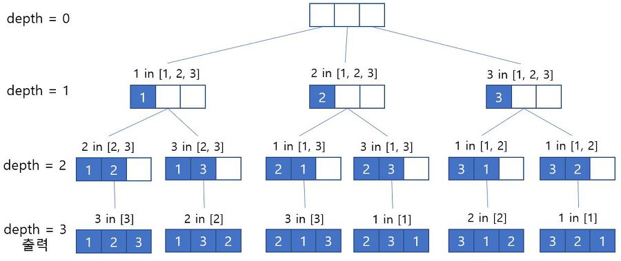

# 순열

- [연습 문제](https://bcp0109.tistory.com/13)

순열이란 `n` 개의 값 중에서 `r` 개의 숫자를 모든 순서대로 뽑는 경우를 말합니다.

예를 들어 `[1, 2, 3]` 이라는 3 개의 배열에서 2 개의 숫자를 뽑는 경우는

```
[1, 2]
[1, 3]
[2, 1]
[2, 3]
[3, 1]
[3, 2]
```

이렇게 6 개가 됩니다.

<br>

## 1. Swap 을 이용한 순열

첫번째는 `swap` 함수를 만들어서 배열들의 값을 직접 바꾸는 방법입니다.

배열의 첫 값부터 순서대로 하나씩 바꾸며 모든 값을 한번씩 `swap` 합니다.

`depth` 를 기준 인덱스로 하여 `depth` 보다 인덱스가 작은 값들은 그대로 고정하고

`depth` 보다 인덱스가 큰 값들만 가지고 다시 `swap` 을 진행합니다.

<br>


<br>

간단하고 코드도 깔끔하게 나오지만 순열들의 순서가 보장되지 않습니다.

예를 들어 3개의 숫자 중 3개의 값을 뽑는 순열을 만들 때

```
[3, 1, 2]
[3, 2, 1]
```

위 순서대로 나와야 하는데

```
[3, 2, 1]
[3, 1, 2]
```

이렇게 나옵니다.

<br>

### Java Code

```java
// 순서 없이 n 개중에서 r 개를 뽑는 경우
// 사용 예시: permutation(arr, 0, n, 4);
static void permutation(int[] arr, int depth, int n, int r) {
    if (depth == r) {
        print(arr, r);
        return;
    }
 
    for (int i=depth; i<n; i++) {
        swap(arr, depth, i);
        permutation(arr, depth + 1, n, r);
        swap(arr, depth, i);
    }
}
 
static void swap(int[] arr, int depth, int i) {
    int temp = arr[depth];
    arr[depth] = arr[i];
    arr[i] = temp;
}

```

<br>

### Result

```
1 2 3
1 3 2
2 1 3
2 3 1
3 2 1
3 1 2
```

<br><br>

## 2. Visited 배열을 이용한 순열

두번째로는 `visited` 배열을 이용하는 방법입니다.

1번과 달리 사전식으로 순열을 구현할 수 있습니다.

<br>

|변수|설명|
|:--:|---|
|`arr`|`r` 개를 뽑기 위한 `n` 개의 값|
|`output`|뽑힌 `r` 개의 값|
|`visited`|중복해서 뽑지 않기 위해 체크하는 값|

<br>

위 3개의 값이 포인트입니다.

DFS를 돌면서 모든 인덱스를 방문하여 `output` 에 값을 넣습니다.

이미 들어간 값은 `visited` 값을 `true` 로 바꾸어 중복하여 넣지 않도록 합니다.

`depth` 값은 `output` 에 들어간 숫자의 길이라고 생각하시면 됩니다.

`depth` 의 값이 `r` 만큼 되면 `output` 에 들어있는 값을 출력하면 됩니다.

<br>



<br>

### Java Code

```java
// 순서를 지키면서 n 개중에서 r 개를 뽑는 경우
// 사용 예시: perm(arr, output, visited, 0, n, 3);
static void perm(int[] arr, int[] output, boolean[] visited, int depth, int n, int r) {
    if (depth == r) {
        print(output, r);
        return;
    }
 
    for (int i=0; i<n; i++) {
        if (visited[i] != true) {
            visited[i] = true;
            output[depth] = arr[i];
            perm(arr, output, visited, depth + 1, n, r);       
            output[depth] = 0; // 이 줄은 없어도 됨
            visited[i] = false;;
        }
    }
}
```

<br>

### Result

```
1 2 3
1 3 2
2 1 3
2 3 1
3 1 2
3 2 1
```

<br><br>

## 전제 소스코드

```java
/**
 * 순열 : n 개 중에서 r 개를 순서있게 뽑기
 * 시간복잡도: O(n!)
 */

public class Permutation {
    public static void main(String[] args) {
        int n = 3;
        int[] arr = {1, 2, 3};
        int[] output = new int[n];
        boolean[] visited = new boolean[n];

        perm(arr, output, visited, 0, n, 3);
        System.out.println();
        permutation(arr, 0, n, 3);
    }

    // 사전순으로 순열 구하기
    // 사용 예시: perm(arr, output, visited, 0, n, 3);
    static void perm(int[] arr, int[] output, boolean[] visited, int depth, int n, int r) {
        if (depth == r) {
            print(output, r);
            return;
        }

        for (int i = 0; i < n; i++) {
            if (visited[i] != true) {
                visited[i] = true;
                output[depth] = arr[i];
                perm(arr, output, visited, depth + 1, n, r);
                visited[i] = false;
                ;
            }
        }
    }

    // 순열 구하기
    // 사용 예시: permutation(arr, 0, n, 4);
    static void permutation(int[] arr, int depth, int n, int r) {
        if (depth == r) {
            print(arr, r);
            return;
        }

        for (int i = depth; i < n; i++) {
            swap(arr, depth, i);
            permutation(arr, depth + 1, n, r);
            swap(arr, depth, i);
        }
    }

    static void swap(int[] arr, int depth, int i) {
        int temp = arr[depth];
        arr[depth] = arr[i];
        arr[i] = temp;
    }

    // 배열 출력
    static void print(int[] arr, int r) {
        for (int i = 0; i < r; i++)
            System.out.print(arr[i] + " ");
        System.out.println();
    }
}
```