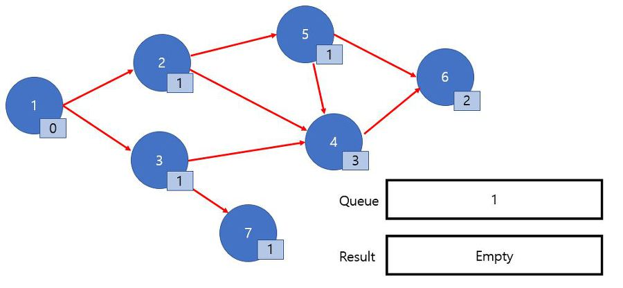
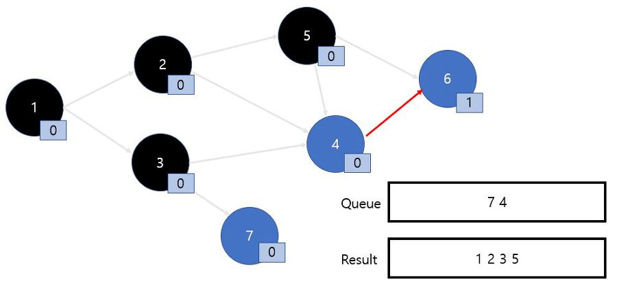

# 위상정렬

- [연습 문제 1](https://bcp0109.tistory.com/22)
- [연습 문제 2](https://bcp0109.tistory.com/23)

<br>

위상 정렬은 그래프 정렬을 말합니다.

그래프의 순서를 정렬하기 때문에 조건이 있습니다.

위상 정렬이 가능하려면 **_DAG(Directed Acyclic Graph, 방향성이 있으며 사이클이 없는 그래프)_** 여야 합니다.

1. 말 그래도 두 노드 A, B 사이에 A -> B 같은 관계가 성립되어야 하며 
2. A -> B, B <- A 처럼 그래프들 사이에 사이클이 없어야 합니다.

위상정렬은 DFS를 사용하여 구현하거나 `indegree` 배열을 사용하여 구현 할 수 있습니다.

가장 주로 쓰이고 간단한 `indegree` 구현에 대해서 알아보겠습니다.

<br>

|변수|설명|
|:--:|---|
|`List<List<Integer>> array`|그래프의 관계를 표현하기 위한 2차원 인접 리스트|
|`int[] indegree`|해당 노드를 가리키는 간선 갯수를 담기 위한 배열|
|`Queue<Integer> q`|`indegree` 값이 0 이 된 노드들을 담기 위한 `Queue`|
|`Queue<Integer> result`|`Queue` 에서 꺼내져 결과로 출력하기 위해 담는 결과 `Queue`|

<br>

간단하게 그래프를 만들어보았습니다. 

동그라미 안에 있는 숫자는 노드의 번호이며, 조그만 네모 안에 있는 숫자들은 자신을 가리키는 간선들의 갯수인 `indegree` 값입니다.

<br>

1. 맨 처음 `indegree` 가 0 인 값들을 `Queue` 에 담고 시작합니다.



<br>

---

2. `Queue` 에서 1을 빼주며 노드 1 에게 가리켜지는 다른 노드들의 `indegree` 값을 1 씩 감소시킵니다.

    사용한 노드와 간선은 지운다고 생각하면 이해하기 쉽습니다.

    아래 그림에서 화살표를 지우고 생각해보면 노드 2 와 노드 3은 자신을 가리키는 간선이 0 인 것을 알 수 있습니다.


<br>

---

3. 그다음은 `Queue` 에서 순서대로 노드 2를 꺼냅니다.

    역시 노드 2와 연결된 간선들을 지우며 연결되어있는 노드들의 `indegree` 값을 감소시킵니다.

    노드 5 의 indegr`ee 값이 0 이 되었으므로 `Queue` 에 넣어줍니다.

    `Queue` 가 전부 비워질 때까지 같은 과정을 반복하면 됩니다.


<br>

---

4. `Queue.pop(3) && Result.add(3)`


<br>

---

5. `Queue.pop(5) && Result.add(5)`



<br>

---

6. `Queue.pop(7) && Result.add(7)`


<br>

---

7. `Queue.pop(4) && Result.add(4)`


<br>

---

8. `Queue.pop(6) && Result.add(6)`


<br>

이렇게 Queue가 비워지고 Result에 들어있는 값이 위상 정렬된 결과값입니다.

순서가 저렇게 나왔지만 사실 위상 정렬은 정해진 결과값이 없습니다.

2와 3의 위치가 바뀌어도 성립합니다.

중요한 점은 화살표가 가리키는 순서는 꼭 지켜져야 한다는 겁니다.

```html
1 - 2 - 5 - 4 - 6
1 - 2 - 4 - 6
1 - 3 - 4 - 6
1 - 3 - 7
```

이 순서는 어떤 정렬 결과가 나오더라도 변하지 않을겁니다.

<br><br>

## Java Code
```java
import java.util.*;

public class TopologicalSort {
    static int n;
    static int e;

    public static void main(String[] args) {
        n = 7; // 정점 갯수
        e = 9; // 간선 갯수
        int[] indegree = new int[n + 1];
        List<List<Integer>> array = new ArrayList<List<Integer>>();

        for (int i = 0; i < n + 1; i++)
            array.add(new ArrayList<Integer>());

        // 간선 목록 v1 -> v2
        int[] v1 = {1, 1, 2, 4, 3, 3, 5, 2, 5};
        int[] v2 = {2, 3, 5, 6, 4, 7, 6, 4, 4};

        /**
         * 1. v1 -> v2 인접리스트 생성
         * 2. v2 를 가리키는 노드 갯수 indegree 증가
         */
        for (int i = 0; i < e; i++) {
            int c1 = v1[i];
            int c2 = v2[i];

            array.get(c1).add(c2);
            indegree[c2]++;
        }

        topologicalSort(indegree, array);
    }

    static void topologicalSort(int[] indegree, List<List<Integer>> array) {
        Queue<Integer> q = new LinkedList<Integer>();
        Queue<Integer> result = new LinkedList<Integer>();

        // 큐에 indegree 가 0 인 노드 담기
        for (int i = 1; i < n + 1; i++) {
            if (indegree[i] == 0) {
                q.offer(i);
            }
        }

        /**
         * 1. 큐에서 값을 꺼내며 해당 노드가 가리키는 노드의 indegree 를 1 감소
         * 2. 만약 indegree가 0 이 된다면 큐에 넣기
         * 3. 큐가 빌때까지 반복
         */
        while (!q.isEmpty()) {
            int node = q.poll();
            result.offer(node);

            for (Integer i : array.get(node)) {
                indegree[i]--;

                if (indegree[i] == 0) {
                    q.offer(i);
                }
            }
        }

        System.out.println(result);
    }
}
```