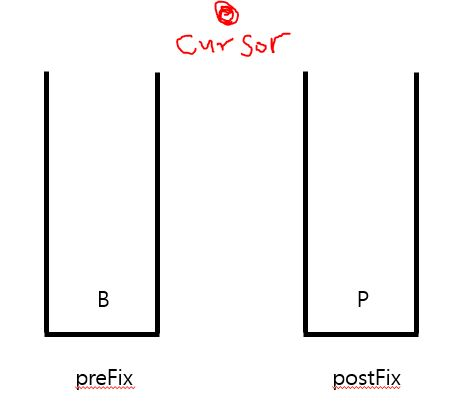
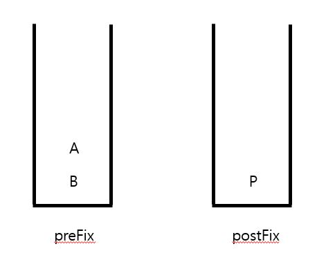

# Problem

- [문제 링크](https://www.acmicpc.net/problem/5397)

<br>

문자열이 주어지면 알파벳과 특수문자를 조합해 최종적으로 화면에 입력된 문제를 출력하는 문제입니다.

<br>

 char| description
 :--:|--
`>` | move right
`<` | move left
`-` | back space

<br><br>

# Solution

`Stack` 두 개를 이용하면 풀 수 있습니다.

스택 두개를 이용하여 현재 위치, 즉 커서를 표현합니다.

커서를 기준으로 두고 `preFix` 스택은 앞의 문자열, `postFix` 스택은 뒤의 문자열로 사용하면서 커서를 이동할때마다 스택끼리 값을 옮겨줍니다.

예제 1번을 따라가보겠습니다.

<br>

---

`<<BP` 까지 입력하면 `preFix` 스택에 아래 그림과 같이 값이 담길겁니다.


<br>

---

이 상태에서 한번 더 `<` 방향으로 이동을 한다면 P 를 오른쪽 스택으로 옮겨줍니다.

커서의 위치는 두 스택의 사이입니다.



<br>

---

위 상태에서 새로운 값 A를 추가한다면 왼쪽 스택에 들어갑니다.

문자열은 `preFix + postFix` 이기 때문에 현재 문자열은 BAP 입니다.

스택 두개를 기준으로 커서를 사용하기 때문에 문자를 추가하거나 뺄 때 `O(1)` 의 시간밖에 걸리지 않습니다.



<br>

---

위 상태에서 `>` 입력이 들어오면 P 를 왼쪽으로 이동시켜줍니다.

이동하는 이유와 현재 커서의 위치를 짐작할 수 있을겁니다.

왼쪽 스택이 비어있다면 커서의 위치는 맨 앞, 오른쪽 스택이 비어있다면 커서의 위치는 맨 뒤가 되는겁니다.


<br>

최종 문자열을 출력할 때는 `preFix` 에 있는 값을 `postFix` 로 전부 옮긴 후 출력하면 순서대로 나옵니다.

저는 번거로워서 그냥 `Deque` 썼습니다.

<br><br>

# Java Code

```java
import java.io.*;
import java.util.*;

class Main {
    public static void main(String[] args) throws Exception {
        BufferedReader br = new BufferedReader(new InputStreamReader(System.in));
        StringBuilder sb = new StringBuilder();
        int n = Integer.parseInt(br.readLine());

        for (int i=0; i<n; i++) {
            String s = br.readLine();
            sb.append(getPassword(s));
            sb.append("\n");
        }

        System.out.println(sb);
    }

    static String getPassword(String input) {
        Deque<Character> preFix = new ArrayDeque<>();
        Deque<Character> postFix = new ArrayDeque<>();
        StringBuilder sb = new StringBuilder();

        for (int i=0; i<input.length(); i++) {
            char c = input.charAt(i);

            switch (c) {
                case '<':
                    if (!preFix.isEmpty()) {
                        postFix.addFirst(preFix.pollLast());
                    }
                    break;
                case '>':
                    if (!postFix.isEmpty()) {
                        preFix.addLast(postFix.pollFirst());
                    }
                    break;
                case '-':
                    if (!preFix.isEmpty()) {
                        preFix.pollLast();
                    }
                    break;
                default:
                    preFix.add(c);
            }
        }

        while (!preFix.isEmpty()) {
            sb.append(preFix.pollFirst());
        }

        while (!postFix.isEmpty()) {
            sb.append(postFix.pollFirst());
        }

        return sb.toString();
    }
}
```
