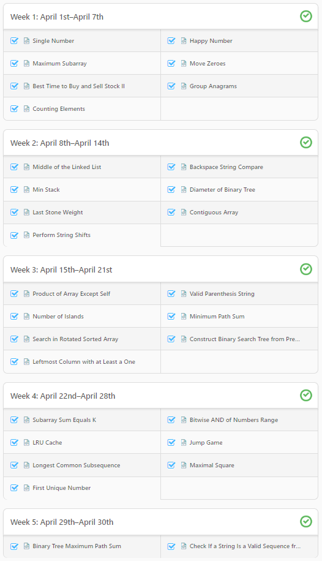

# 30-Day LeetCoding Challenge

 [30-Day LeetCoding Challenge on our Explore Card section](https://leetcode.com/explore/featured/card/30-day-leetcoding-challenge/)

This 30-Day LeetCoding Challenge will **start from April 1st, 00:00 AM and end on April 30th, 23:59 PM in Pacific Standard Time.**

These problems are carefully hand-picked from LeetCode's curated collection of frequently asked interview questions, including **5 brand-new problems.**

1. **Valid challenge time period**: Each daily challenge is available from 00:00 AM to 23:59 PM Pacific Standard Time in the same day.
2. **Reward Eligibility**: Participants need to complete each daily challenge within its valid challenge time period to be eligible for the *Rewards.
    - The problems for each daily challenge will continue to be available after its valid challenge time period, but completing challenges outside of their valid challenge time period will NOT be eligible for rewards.
3. **Resubmission**: Challenge problems completed prior to this LeetCoding Challenge must be resubmitted during each problem's valid challenge time period in the Challenge Explore Card to be eligible for rewards.
4. **Don't**: Participants will get the most out of this LeetCoding Challenge by solving the problems individually, so please refrain from copy-pasting solutions found elsewhere.

 

# Summary

2020년 4월 1일부터 2020년 4월 30일까지 리트코드에서 선정한 문제가 하루에 하나씩 나타탑니다.

누구나 자유롭게 참가할 수 있으며, 따로 신청은 필요 없이 문제를 풀면 됩니다.

제출 시간은 태평양 시간으로 **00:00 AM to 23:59 PM** 이며 한국 시간으로는 **17:00 PM 시작**입니다.

새로운 문제가 아니기 때문에 이전에 풀었던 문제일 수 있으며, **이전에 풀었던 사람은 다시 제출(Resubmission)** 해야 인정됩니다.

문제가 올라온 후 24시간 내로 풀어야 보상(LeetCoins)을 받을 수 있으며, 시간이 지나도 문제를 풀 수는 있지만 보상은 없습니다.

 

# Submission

전부 제출 성공

 

# Problem

Day  | Problem
:--: | --
1 | [Single Number](../single-number.md)
2 | [Happy Number](../happy-number.md)
3 | [Maximum Subarray](../maximum-subarray.md)
4 | [Move Zeroes](../move-zeroes.md)
5 | [Best Time to Buy and Sell Stock II](../best-time-to-buy-and-sell-stock-ii.md)
6 | [Group Anagrams](../group-anagrams.md)
7 | [Counting Elements](../counting-elements.md)
8 | [Middle of the Linked List](../middle-of-the-linked-list.md)
9 | [Backspace String Compare](../backspace-string-compare.md)
10 | [Min Stack](../min-stack.md)
11 | [Diameter of Binary Tree](../diameter-of-binary-tree.md)
12 | [Last Stone Weight](../last-stone-weight.md)
13 | [Contiguous Array](../contiguous-array.md)
14 | [Perform String Shifts](../perform-string-shifts.md)
15 | [Product of Array Except Self](../product-of-array-except-self.md)
16 | [Valid Parenthesis String](../valid-parenthesis-string.md)
17 | [Number of Islands](../number-of-islands.md)
18 | [Minimum Path Sum](../minimum-path-sum.md)
19 | [Search in Rotated Sorted Array](../search-in-rotated-sorted-array.md)
20 | [Construct Binary Search Tree from Preorder Traversal](../construct-binary-search-tree-from-preorder-traversal.md)
21 | [Leftmost Column with at Least a One](../leftmost-column-with-at-least-a-one.md)
22 | [Subarray Sum Equals K](../subarray-sum-equals-k.md)
23 | [Bitwise AND of Numbers Range](../bitwise-and-of-numbers-range.md)
24 | [LRU Cache](../lru-cache.md)
25 | [Jump Game](../jump-game.md)
26 | [Longest Common Subsequence](../longest-common-subsequence.md)
27 | [Maximal Square](../maximal-square.md)
28 | [First Unique Number](../first-unique-number.md)
29 | [Binary Tree Maximum Path Sum](../binary-tree-maximum-path-sum.md)
30 | [Check If a String Is a Valid Sequence from Root to Leaves Path in a Binary Tree](../check-valid-in-a-binary-tree.md)
