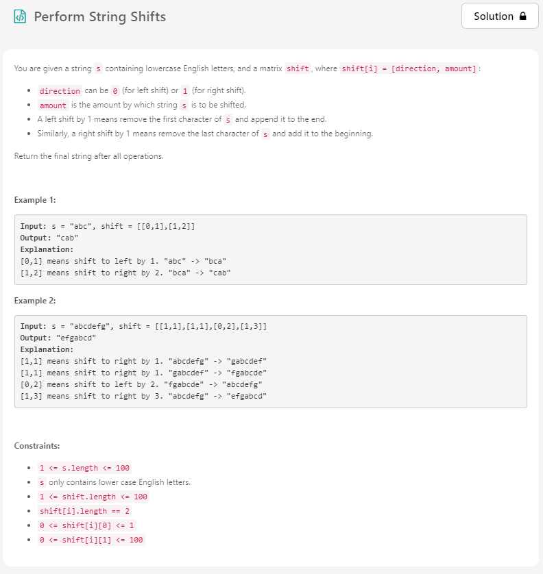

# Problem



<br>

문자열 `s`와 움직이는 방향과 횟수가 담긴 `shift` 배열이 주어졌을 때 최종 문자열을 리턴하는 문제입니다.

<br><br>

# Solution 1

`Deque` 자료구조를 사용하여 문제에서 제시하는 대로 구현하면 됩니다.

<br><br>

# Java Code 1

```java
class Solution {
    public String stringShift(String s, int[][] shift) {
        Deque<Character> deque = new ArrayDeque<>();
        
        for (char c : s.toCharArray()) {
            deque.addLast(c);
        }
        
        for (int[] shi : shift) {
            int direction = shi[0];
            int amount = shi[1];
            
            for (int i = 0; i < amount; i++) {
                if (direction == 0) {
                    deque.addLast(deque.pollFirst());
                } else {
                    deque.addFirst(deque.pollLast());
                }
            }
        }
        
        StringBuilder sb = new StringBuilder();
        
        while (!deque.isEmpty()) {
            sb.append(deque.pollFirst());
        }

        return sb.toString();
    }
}
```
<br><br><br>

# Solution 2

매번 `Deque` 로 `add`, `poll` 하지 않고 최종 움직임만 한번에 계산해서 답을 구할 수 있습니다.

왼쪽은 -1, 오른쪽은 +1 로 하여 `move` 값을 구한 뒤 문자열의 시작 부분인 `start` 값을 구해

`substring` 으로 답을 구합니다.

<br><br>

# Java Code 2

```java
class Solution {
    public String stringShift(String s, int[][] shift) {
        int move = 0;
        int len = s.length();
        
        for (int[] shi : shift) {
            int direction = (shi[0] == 0) ? -1 : 1;
            int amount = shi[1];
            
            move += direction * amount;
        }
        
        int start = (len - move % len) % len;
        
        return s.substring(start) + s.substring(0, start);
    }
}
```