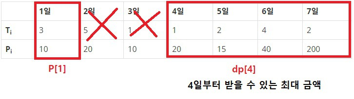

# Problem
- [문제 링크](https://www.acmicpc.net/problem/14501)

앞으로 남은 근무일과 상담일정이 주어졌을 때 상담으로 얻는 최대 수익을 구하는 문제입니다.
<br>
<br>

# Solution
*DP* 문제입니다.

`for` 문을 뒤에서부터 시작하여 `dp` 값을 차곡차곡 쌓아서 `dp[1]` 을 출력해주면 됩니다.



1일에는 3일동안 상담을 할 수 있으므로 1, 2, 3 일을 소모하게 됩니다.

그럼 최대한 많은 금액을 받기 위해서는

**1일 금액 + 4일부터 받을 수 있는 최대 금액**

이것이 1일에 상담을 할 경우 얻을 수 있는 최대 금액입니다.

x일부터 받을 수 있는 최대 금액을 저장하기 위해 dp 배열을 사용합니다.

`P[1] + dp[4]` 라는 첫번째 식을 얻었습니다.

그런데 1일에 상담을 하는 경우보다 2일에 상담을 하는 경우가 최고 금액일 수 있습니다.

예를 들어 `P[1] + dp[4]` 의 금액이 50인데 `dp[2]` 가 100 일 가능성이 있습니다.

그러므로 두 개의 값 중 더 큰 값이 1일부터 받을 수 있는 최대 금액입니다.

`dp[1] = MAX(P[1] + dp[4], dp[2])`

일반 수식으로 변환하면

`dp[i] = MAX(P[i] + dp[i+T[i]], dp[i+1])`

만약 상담일이 퇴사일을 초과하면 자동으로 `dp[i+1]` 의 값이 받을수 있는 최대금액이 됩니다.

마지막 날에도 1일의 상담을 할 수 있습니다. `i + T[i] <= N + 1` 로 수식을 세워야 합니다.

대신 배열을 선언할 때 1 의 여유공간을 추가로 더 선언합니다.
<br>
<br>

# Java Code
```java
import java.util.*;
import java.io.*;
import java.lang.*;

class Main {
    public static void main(String[] args) throws Exception {
        BufferedReader br = new BufferedReader(new InputStreamReader(System.in));
        StringTokenizer st;

        int N = Integer.parseInt(br.readLine());
        int[] T = new int[N + 2];
        int[] P = new int[N + 2];
        int[] dp = new int[N + 2];

        for (int i = 1; i <= N; i++) {
            st = new StringTokenizer(br.readLine());
            T[i] = Integer.parseInt(st.nextToken());
            P[i] = Integer.parseInt(st.nextToken());
        }

        for (int i = N; i > 0; i--) {
            int day = i + T[i];     // i번째 날의 상담기간

            if (day <= N + 1)
                dp[i] = Math.max(P[i] + dp[day], dp[i + 1]);
            else    // 상담일 초과
                dp[i] = dp[i + 1];
        }

        System.out.println(dp[1]);
    }
}
```
<br>
<br>

# Python Code
```python
# -*- coding: utf-8 -*-
 
import sys
 
def solve(n, t, p):
    dp = [0 for i in range(n)]
    
    ## 초기값
    ## 1일간만 상담해야 들어갈 수 있음
    if t[n-1] == 1:
        dp[n-1] = p[n-1]
 
    ## 뒤에서부터 계산함
    for i in range(n-2, -1, -1):
        day = i + t[i]
 
        ## 상담가능일이 n이랑 똑같으면 이후엔 상담불가능
        if day == n:
            dp[i] = max([p[i], dp[i+1]])
        ## 상담 가능일이 n보다 작으면 이후에 상담가능
        elif day < n:
            dp[i] = max([p[i] + dp[day], dp[i+1]])
        elif day > n:
            dp[i] = dp[i+1]
 
    print(dp[0])
 
if __name__ == '__main__':
    n = int(sys.stdin.readline())
    t = []
    p = []
 
    for i in range(n):
        ti, pi = map(int, sys.stdin.readline().split())
        t.append(ti)
        p.append(pi)
 
    solve(n, t, p)
```