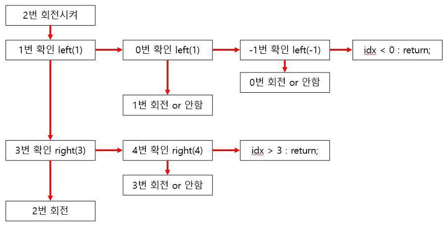

# Problem
- [문제 링크](https://www.acmicpc.net/problem/14891)

톱니바퀴의 초기 상태와 톱니바퀴를 회전시킨 방법이 주어졌을 때, 최종 톱니바퀴의 상태를 구하여

접수의 합을 출력하는 문제입니다.
<br>
<br>

# Solution
특별한 알고리즘은 없이 톱니의 상태에 맞추어 톱니바퀴를 회전시키는 단순 구현 시뮬레이션 문제입니다.

이 문제에서 주의해야 할 점은 두 가지 입니다.

1. 좌, 우 톱니바퀴의 회전 여부는 회전이 이루어지기 전에 결정된다.
2. 톱니바퀴의 번호는 0 ~ 3 이 아니라 1 ~ 4 다.

1 번은 말그대로 톱니바퀴를 회전시키기 전에 모든 톱니바퀴에 대해서 회전 여부가 결정되어야 합니다.

저는 재귀를 통해 현재 상태에서 N 극과 S 극을 비교하여 회전 여부를 결정하고 

가장 끝에있는 1 번 또는 4 번 부터 회전시켰습니다.

2 번은 사소한 실수인데 보통 톱니바퀴를 배열로 선언하다보니 0 ~ 3 이라고 착각하는 경우가 있습니다.

구현하는 함수는 톱니바퀴를 회전시키는 `rotate` 함수와 

좌, 우 톱니바퀴 회전 여부를 판단하기 위한 `left`, `right` 함수입니다.

톱니바퀴를 회전시키는 건 `for` 문을 사용하면 됩니다.

`left`, `right` 함수는 재귀를 통하여 모든 톱니바퀴의 회전 여부를 검사합니다.

톱니바퀴의 번호가 0 ~ 3 이라고 생각하고 2 번을 회전시키라는 명령이 들어오면 다음과 같은 로직으로 진행됩니다.



회전 여부를 확인하기 위해 호출되는 것이 `left`, `right` 함수고 시간 순서대로 화살표를 따라서 진행됩니다.

코드를 보시면 쉽게 이해하실 수 있습니다.

*파이썬은 `deque` 를 자료구조를 사용하였고 `deque` 에 있는 `rotate` 함수를 사용하였습니다.*
<br>
<br>

# Java Code
```java
import java.util.*;
import java.io.*;

class Main {
    static int stoi(String s) {
        return Integer.parseInt(s);
    }

    // 톱니바퀴 [번호][방향]
    static int[][] arr = new int[4][8];

    public static void main(String[] args) throws Exception {
        BufferedReader br = new BufferedReader(new InputStreamReader(System.in));
        StringTokenizer st;

        for (int i = 0; i < 4; i++) {
            String s = br.readLine();
            for (int j = 0; j < 8; j++) {
                arr[i][j] = s.charAt(j) - '0';
            }
        }

        int k = stoi(br.readLine());

        // 톱니바퀴 회전
        for (int i = 0; i < k; i++) {
            st = new StringTokenizer(br.readLine());
            int idx = stoi(st.nextToken());
            int dir = stoi(st.nextToken());

            // 톱니바퀴 번호는 1~4, 인덱스는 0~3
            solution(idx - 1, dir);
        }

        // 점수 계산
        int score = 0;
        for (int i = 0; i < 4; i++) {
            score += arr[i][0] * (1 << i);
        }

        System.out.println(score);
    }

    // 9시 방향은 2, 3시 방향은 6
    static void solution(int idx, int dir) {
        left(idx - 1, -dir);
        right(idx + 1, -dir);
        rotate(idx, dir);
    }

    // 왼쪽에 있던 톱니바퀴 회전 여부 결정
    static void left(int idx, int dir) {
        if (idx < 0) return;

        if (arr[idx][2] != arr[idx + 1][6]) {
            left(idx - 1, -dir);
            rotate(idx, dir);
        }
    }

    // 오른쪽에 있던 톱니바퀴 회전 여부 결정
    static void right(int idx, int dir) {
        if (idx > 3) return;

        if (arr[idx][6] != arr[idx - 1][2]) {
            right(idx + 1, -dir);
            rotate(idx, dir);
        }
    }

    // dir = 1 시계방향, dir = -1 반시계방향
    static void rotate(int idx, int dir) {
        if (dir == 1) {
            int temp = arr[idx][7];

            for (int i = 7; i > 0; i--) {
                arr[idx][i] = arr[idx][i - 1];
            }

            arr[idx][0] = temp;

        } else {
            int temp = arr[idx][0];

            for (int i = 0; i < 7; i++) {
                arr[idx][i] = arr[idx][i + 1];
            }

            arr[idx][7] = temp;
        }
    }
}
```
<br>
<br>

# Python Code
```python
# -*- coding: utf-8 -*-
 
import sys
import collections
 
wheels = []
turns = []
 
def turnLeft(i, d):
    if i < 0:
        return
 
    if wheels[i][2] != wheels[i+1][6]:
        turnLeft(i-1, -d)
        wheels[i].rotate(d)
 
def turnRight(i, d):
    if i > 3:
        return
 
    if wheels[i][6] != wheels[i-1][2]:
        turnRight(i+1, -d)
        wheels[i].rotate(d)
 
def solve():
    for turn in turns:
        [idx, direction] = turn
        
        turnLeft(idx-1, -direction)
        turnRight(idx+1, -direction)
 
        wheels[idx].rotate(direction)
 
if __name__ == '__main__':
    for i in range(4):
        wheels.append(collections.deque(list(sys.stdin.readline())[:8]))
 
    K = int(sys.stdin.readline())
 
    for i in range(K):
        v1, v2 = map(int, sys.stdin.readline().split())
        turns.append([v1-1, v2])
 
    solve()
    sumVal = 0
    for i, wheel in enumerate(wheels):
        sumVal += int(wheel[0]) * (1 << i)
    print(sumVal)
```